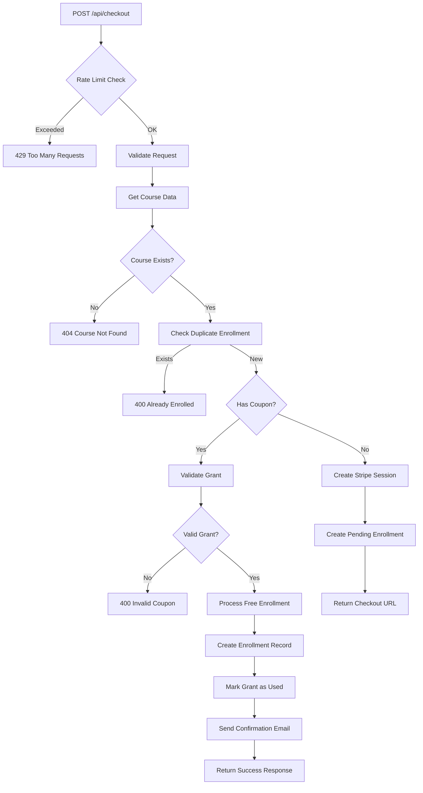

# API Routes Documentation

> **Complete reference for all REST API endpoints in the MaalEdu platform**
> 
> Last Updated: December 8, 2025  
> Version: 2.0

---

## Table of Contents

1. [Core Payment APIs](#core-payment-apis)
2. [Affiliate APIs](#affiliate-apis)
3. [Grant APIs](#grant-apis)
4. [Admin APIs](#admin-apis)
5. [Course APIs](#course-apis)
6. [Cron Jobs](#cron-jobs)
7. [Authentication](#authentication)
8. [Rate Limiting](#rate-limiting)

---

## Core Payment APIs

### 1. Checkout API

**Endpoint:** `POST /api/checkout`  
**Purpose:** Main payment processing endpoint supporting both paid and free enrollments  
**Rate Limit:** 10 requests per minute per IP  
**Authentication:** Public (guest checkout supported)

#### Request Body

```typescript
{
  courseId: string;           // Required: Course identifier
  email?: string;             // Optional: Student email (temp generated if missing)
  couponCode?: string;        // Optional: Grant coupon for discounts
  affiliateEmail?: string;    // Optional: Affiliate referral email
  username?: string;          // Optional: Frappe LMS username
  redirectSource?: 'lms_redirect' | 'direct' | 'affiliate';
  requestId?: string;         // Optional: Unique request identifier
}
```

#### Response - Paid Enrollment (Stripe)

```json
{
  "success": true,
  "checkoutUrl": "https://checkout.stripe.com/c/pay/cs_test_...",
  "sessionId": "cs_test_1234567890",
  "enrollment": {
    "id": "674abc123def456",
    "courseId": "blockchain-basics",
    "amount": 199,
    "status": "pending",
    "enrollmentType": "paid_stripe"
  }
}
```

#### Response - Free Enrollment (Grant)

```json
{
  "success": true,
  "enrolled": true,
  "message": "Free enrollment successful",
  "enrollmentType": "free_grant",
  "enrollment": {
    "id": "674abc123def456",
    "courseId": "blockchain-basics",
    "email": "student@example.com",
    "status": "paid",
    "grantData": {
      "couponCode": "GRANT100_ABC",
      "discountPercentage": 100
    }
  }
}
```

#### Error Responses

```json
// Duplicate enrollment
{
  "error": "Already enrolled in this course",
  "code": "DUPLICATE_ENROLLMENT",
  "retryable": false,
  "enrollmentId": "674abc123def456"
}

// Invalid coupon
{
  "error": "Invalid or expired coupon code",
  "code": "INVALID_COUPON",
  "retryable": false
}

// Self-referral blocked
{
  "error": "You cannot use your own email as an affiliate referral",
  "code": "SELF_REFERRAL_NOT_ALLOWED",
  "retryable": false,
  "suggestions": [
    "Leave the affiliate field empty to enroll normally"
  ]
}
```

#### Business Logic Flow



#### Key Features

1. **Self-Referral Prevention**
   - Blocks users from using their own email as affiliate
   - Returns clear error message with suggestions

2. **Atomic Grant Reservation**
   - Uses `reservedAt` timestamp for atomic coupon usage
   - Prevents race conditions in high-traffic scenarios

3. **Affiliate Commission Calculation**
   ```typescript
   commissionAmount = coursePrice * (affiliate.commissionRate / 100)
   // e.g., $199 * (10 / 100) = $19.90
   ```

4. **Partial Grant Support**
   - Discounts from 10-100%
   - Requires payment if discount < 100%
   - Stripe session includes discounted amount

5. **Retry Strategy**
   - Database-backed retry queue for failed Frappe syncs
   - Exponential backoff (2min → 32min)
   - Max 5 retry attempts

---

### 2. Webhook API

**Endpoint:** `POST /api/webhook`  
**Purpose:** Stripe webhook handler for payment confirmations  
**Authentication:** Stripe signature verification  
**Idempotency:** Event ID tracking

#### Headers Required

```
stripe-signature: t=1234567890,v1=abc123...
```

#### Event Handling

| Event Type | Action |
|------------|--------|
| `checkout.session.completed` | Process paid enrollment, sync to Frappe LMS |
| `payment_intent.succeeded` | Update payment verification |
| Other events | Log and acknowledge |

#### Processing Flow

```typescript
1. Verify Stripe signature
2. Extract event data
3. Check idempotency (prevent duplicate processing)
4. Find enrollment by metadata.enrollmentId
5. Atomic status update (pending → paid)
6. Process affiliate commission
7. Sync to Frappe LMS (with immediate retry)
8. Send confirmation email
9. Update webhook event status
```

#### Response

```json
{
  "received": true,
  "eventId": "evt_1234567890"
}
```

#### Webhook Security

1. **Signature Verification**
   ```typescript
   const signature = request.headers.get('stripe-signature');
   const event = stripe.webhooks.constructEvent(
     body, signature, endpointSecret
   );
   ```

2. **Idempotency Check**
   ```typescript
   // Atomic check: only process if event not in stripeEvents array
   const updated = await Enrollment.findOneAndUpdate(
     { _id: enrollmentId, 'stripeEvents.eventId': { $ne: event.id } },
     { $addToSet: { stripeEvents: { eventId: event.id, ... } } }
   );
   ```

3. **Double Sync Prevention**
   ```typescript
   // Only sync if status is not already 'paid'
   const enrollment = await Enrollment.findOneAndUpdate(
     { _id: enrollmentId, status: { $ne: 'paid' } },
     { $set: { status: 'paid' } }
   );
   ```

---

### 3. Complete Enrollment API (Fallback)

**Endpoint:** `POST /api/complete-enrollment`  
**Purpose:** Fallback enrollment completion when webhook doesn't fire  
**Authentication:** Public  
**Called By:** Success page (`/success`)

#### Request Body

```json
{
  "sessionId": "cs_test_1234567890"
}
```

#### Response

```json
{
  "success": true,
  "message": "Enrollment completed successfully",
  "enrollment": {
    "id": "674abc123def456",
    "status": "paid",
    "courseId": "blockchain-basics",
    "email": "student@example.com",
    "frappeSync": {
      "synced": true,
      "syncStatus": "success",
      "enrollmentId": "1d4ci0933i"
    }
  }
}
```

#### Error Handling

```json
// Payment not completed
{
  "error": "Payment not completed",
  "payment_status": "unpaid"
}

// Enrollment not found
{
  "error": "No enrollment ID in session metadata"
}
```

---

### 4. Manual Sync API

**Endpoint:** `POST /api/manual-sync`  
**Purpose:** Manually trigger Frappe LMS sync for debugging  
**Authentication:** Public (should be secured in production)  
**Use Case:** Admin troubleshooting

#### Request Body (Option 1: By Email)

```json
{
  "email": "student@example.com"
}
```

#### Request Body (Option 2: By Enrollment ID)

```json
{
  "enrollmentId": "674abc123def456"
}
```

#### Response - Success

```json
{
  "success": true,
  "message": "Successfully synced to Frappe LMS",
  "enrollment": {
    "id": "674abc123def456",
    "email": "student@example.com",
    "courseId": "blockchain-basics",
    "frappeEnrollmentId": "1d4ci0933i"
  }
}
```

#### Response - Already Synced

```json
{
  "success": true,
  "message": "Already synced to Frappe LMS",
  "enrollment": {
    "id": "674abc123def456",
    "frappeEnrollmentId": "1d4ci0933i",
    "syncedAt": "2025-12-03T10:30:00.000Z"
  }
}
```

---

## Affiliate APIs

### 1. Affiliate Registration

**Endpoint:** `POST /api/affiliate/register`  
**Purpose:** Register new affiliate account  
**Authentication:** Required (NextAuth)

#### Request Body

```json
{
  "name": "John Affiliate",
  "email": "affiliate@example.com",
  "commissionRate": 10,
  "payoutMode": "paypal",
  "paymentMethod": {
    "type": "paypal",
    "paypalEmail": "affiliate@example.com"
  }
}
```

#### Response

```json
{
  "success": true,
  "affiliate": {
    "affiliateId": "af_1234567890",
    "email": "affiliate@example.com",
    "name": "John Affiliate",
    "status": "active",
    "affiliateLink": "https://lms.maaledu.com/?ref=affiliate@example.com"
  }
}
```

---

### 2. Affiliate Status

**Endpoint:** `GET /api/affiliate/status`  
**Purpose:** Get affiliate account details and statistics  
**Authentication:** Required

#### Response

```json
{
  "affiliate": {
    "affiliateId": "af_1234567890",
    "email": "affiliate@example.com",
    "name": "John Affiliate",
    "status": "active",
    "commissionRate": 10,
    "affiliateLink": "https://lms.maaledu.com/?ref=affiliate@example.com"
  },
  "stats": {
    "totalEarnings": 1500.00,
    "totalReferrals": 30,
    "pendingCommissions": 250.00,
    "totalPaid": 1250.00,
    "coursesSold": {
      "blockchain-basics": 10,
      "ai-fundamentals": 20
    }
  }
}
```

---

### 3. Refresh Stats

**Endpoint:** `POST /api/affiliate/refresh-stats`  
**Purpose:** Recalculate affiliate statistics from enrollments  
**Authentication:** Required

#### Response

```json
{
  "success": true,
  "stats": {
    "totalEarnings": 1500.00,
    "totalReferrals": 30,
    "pendingCommissions": 250.00
  }
}
```

---

### 4. Referrals List

**Endpoint:** `GET /api/affiliate/referrals`  
**Purpose:** Get list of referred enrollments  
**Authentication:** Required

#### Query Parameters

```
?limit=10&page=1&status=paid
```

#### Response

```json
{
  "referrals": [
    {
      "enrollmentId": "674abc123def456",
      "courseId": "blockchain-basics",
      "customerEmail": "student@example.com",
      "amount": 199,
      "commissionAmount": 19.90,
      "enrolledAt": "2025-12-01T10:00:00.000Z",
      "status": "paid"
    }
  ],
  "pagination": {
    "total": 30,
    "page": 1,
    "pages": 3
  }
}
```

---

### 5. Payout History

**Endpoint:** `GET /api/affiliate/payout-history`  
**Purpose:** Get payout transaction history  
**Authentication:** Required

#### Response

```json
{
  "payouts": [
    {
      "payoutId": "payout_123",
      "amount": 150.00,
      "payoutMethod": "paypal",
      "transactionId": "txn_abc123",
      "processedAt": "2025-11-30T15:00:00.000Z",
      "status": "processed",
      "commissionsCount": 8
    }
  ]
}
```

---

## Grant APIs

### 1. Apply for Grant

**Endpoint:** `POST /api/grants/apply`  
**Purpose:** Submit grant application  
**Authentication:** Public

#### Request Body

```json
{
  "name": "Jane Student",
  "email": "student@example.com",
  "username": "janestudent",
  "age": 22,
  "socialAccounts": "LinkedIn: linkedin.com/in/janestudent",
  "reason": "I am passionate about blockchain technology...",
  "courseId": "blockchain-basics"
}
```

#### Response

```json
{
  "success": true,
  "message": "Grant application submitted successfully",
  "grantId": "674ghi789jkl012",
  "status": "pending"
}
```

---

### 2. Validate Coupon

**Endpoint:** `POST /api/coupons/validate`  
**Purpose:** Validate grant coupon code  
**Authentication:** Public

#### Request Body

```json
{
  "couponCode": "GRANT100_ABC",
  "courseId": "blockchain-basics",
  "email": "student@example.com"
}
```

#### Response - Valid

```json
{
  "valid": true,
  "grant": {
    "grantId": "674ghi789jkl012",
    "discountPercentage": 100,
    "originalPrice": 199,
    "finalPrice": 0,
    "requiresPayment": false
  }
}
```

#### Response - Invalid

```json
{
  "valid": false,
  "error": "Coupon code has expired",
  "code": "COUPON_EXPIRED"
}
```

---

## Admin APIs

### 1. Approve Grant

**Endpoint:** `POST /api/admin/grants/approve`  
**Purpose:** Approve grant application with discount  
**Authentication:** Required (admin role)

#### Request Body

```json
{
  "grantId": "674ghi789jkl012",
  "discountPercentage": 50,
  "adminNotes": "Approved - strong application"
}
```

#### Response

```json
{
  "success": true,
  "grant": {
    "grantId": "674ghi789jkl012",
    "status": "approved",
    "couponCode": "GRANT50_ABC123",
    "discountPercentage": 50
  },
  "emailSent": true
}
```

---

### 2. Retry Frappe Sync

**Endpoint:** `POST /api/admin/retry-frappe-sync`  
**Purpose:** Manually retry failed Frappe LMS syncs  
**Authentication:** Required (admin role)

#### Request Body

```json
{
  "enrollmentId": "674abc123def456"
}
```

#### Response

```json
{
  "success": true,
  "message": "Sync completed successfully",
  "frappeEnrollmentId": "1d4ci0933i"
}
```

---

### 3. Analytics

**Endpoint:** `GET /api/admin/analytics`  
**Purpose:** Platform-wide analytics dashboard  
**Authentication:** Required (admin role)

#### Response

```json
{
  "overview": {
    "totalRevenue": 50000,
    "totalEnrollments": 250,
    "activeAffiliates": 15,
    "pendingGrants": 10
  },
  "recentEnrollments": [...],
  "topCourses": [...],
  "affiliatePerformance": [...]
}
```

---

## Course APIs

### 1. Get Course Details

**Endpoint:** `GET /api/courses/[id]`  
**Purpose:** Fetch course information  
**Authentication:** Public

#### Response

```json
{
  "course": {
    "courseId": "blockchain-basics",
    "title": "Blockchain Fundamentals",
    "description": "Learn blockchain technology...",
    "price": 199,
    "duration": "8 weeks",
    "level": "Beginner",
    "image": "https://...",
    "features": [
      "24/7 Support",
      "Certificate",
      "Lifetime Access"
    ],
    "totalEnrollments": 150
  }
}
```

---

### 2. List Courses

**Endpoint:** `GET /api/courses`  
**Purpose:** Get all active courses  
**Authentication:** Public

#### Query Parameters

```
?status=published&level=Beginner&sort=price
```

#### Response

```json
{
  "courses": [
    {
      "courseId": "blockchain-basics",
      "title": "Blockchain Fundamentals",
      "price": 199,
      "level": "Beginner"
    }
  ],
  "total": 10
}
```

---

## Cron Jobs

### 1. Frappe Retry Cron

**Endpoint:** `GET /api/cron/frappe-retry`  
**Purpose:** Process retry job queue  
**Schedule:** Daily at midnight (00:00 UTC)  
**Authentication:** Vercel Cron Secret

#### Headers Required

```
Authorization: Bearer ${CRON_SECRET}
```

#### Process

1. Claim pending jobs from RetryJob queue
2. Attempt Frappe LMS sync
3. Update job status (completed/failed/retry)
4. Calculate next retry time with exponential backoff
5. Release stuck jobs (timeout > 10 minutes)

#### Response

```json
{
  "success": true,
  "processed": 5,
  "completed": 3,
  "failed": 1,
  "retrying": 1,
  "queueHealth": "healthy"
}
```

---

## Authentication

### NextAuth Configuration

**Endpoints:**
- `POST /api/auth/signin` - Sign in
- `POST /api/auth/signup` - Sign up
- `GET /api/auth/session` - Get session
- `POST /api/auth/signout` - Sign out

### Protected Routes

Routes requiring authentication use NextAuth middleware:

```typescript
// middleware.ts
export const config = {
  matcher: [
    '/admin/:path*',
    '/affiliate-dashboard/:path*',
    '/dashboard/:path*'
  ]
};
```

### Public API Endpoints

- `/api/checkout`
- `/api/webhook`
- `/api/complete-enrollment`
- `/api/manual-sync`
- `/api/coupons/validate`
- `/api/grants/apply`
- `/api/courses/:path*`

---

## Rate Limiting

### Implementation

Uses Redis (Upstash) for distributed rate limiting:

```typescript
// Rate limits by endpoint
export const rateLimits = {
  checkout: { requests: 10, window: 60 }, // 10 req/min
  webhook: { requests: 100, window: 60 }, // 100 req/min
  grants: { requests: 5, window: 300 },   // 5 req/5min
  default: { requests: 30, window: 60 }   // 30 req/min
};
```

### Response Headers

```
X-RateLimit-Limit: 10
X-RateLimit-Remaining: 5
X-RateLimit-Reset: 1733212800
```

### Error Response

```json
{
  "error": "Too many requests",
  "retryAfter": 45
}
```

---

## Error Codes Reference

| Code | Description | HTTP Status | Retryable |
|------|-------------|-------------|-----------|
| `COURSE_NOT_FOUND` | Course does not exist | 404 | No |
| `DUPLICATE_ENROLLMENT` | User already enrolled | 400 | No |
| `INVALID_COUPON` | Coupon invalid/expired | 400 | No |
| `SELF_REFERRAL_NOT_ALLOWED` | Self-affiliate blocked | 400 | No |
| `PAYMENT_FAILED` | Stripe payment error | 402 | Yes |
| `FRAPPE_SYNC_FAILED` | LMS sync error | 500 | Yes |
| `RATE_LIMIT_EXCEEDED` | Too many requests | 429 | Yes |

---

**End of API Documentation**
