# Webhook & Integration Documentation

> **Complete guide for webhook handling, external integrations, and event processing**
> 
> Last Updated: December 8, 2025  
> Version: 2.0

---

## Table of Contents

1. [Stripe Webhook System](#stripe-webhook-system)
2. [Frappe LMS Integration](#frappe-lms-integration)
3. [Email Service Integration](#email-service-integration)
4. [Retry & Queue System](#retry--queue-system)
5. [Event Flow Diagrams](#event-flow-diagrams)
6. [Security Best Practices](#security-best-practices)
7. [Troubleshooting](#troubleshooting)

---

## Stripe Webhook System

### Overview

The Stripe webhook system handles payment confirmations and synchronizes enrollment data with the Frappe LMS platform.

**Endpoint:** `POST /api/webhook`  
**Provider:** Stripe  
**Authentication:** Signature verification

### Setup Instructions

#### 1. Configure Stripe Dashboard

1. Go to **Stripe Dashboard → Developers → Webhooks**
2. Click **Add endpoint**
3. Enter endpoint URL:
   ```
   https://your-domain.com/api/webhook
   ```
4. Select events to listen to:
   - ✅ `checkout.session.completed`
   - ✅ `payment_intent.succeeded`
   - ✅ `payment_intent.payment_failed`
5. Copy the **Signing secret** (starts with `whsec_...`)

#### 2. Environment Configuration

Add to `.env.local` and Vercel environment variables:

```bash
STRIPE_WEBHOOK_SECRET=whsec_xxxxxxxxxxxxxxxxxxxxx
STRIPE_SECRET_KEY=sk_live_xxxxxxxxxxxxxxxxxxxxx
```

#### 3. Verify Setup

Test webhook using Stripe CLI:

```bash
stripe listen --forward-to localhost:3000/api/webhook
stripe trigger checkout.session.completed
```

---

### Event Handling

#### Supported Events

| Event | Priority | Action |
|-------|----------|--------|
| `checkout.session.completed` | High | Process enrollment, sync to LMS |
| `payment_intent.succeeded` | Medium | Update payment verification |
| `payment_intent.payment_failed` | Medium | Mark enrollment as failed |
| Other events | Low | Log and acknowledge |

#### Event Processing Flow

```typescript
// 1. Signature Verification
const signature = request.headers.get('stripe-signature');
const event = stripe.webhooks.constructEvent(body, signature, secret);

// 2. Idempotency Check
const alreadyProcessed = await Enrollment.findOne({
  'stripeEvents.eventId': event.id
});

if (alreadyProcessed) {
  return NextResponse.json({ received: true });
}

// 3. Extract Session Data
const session = event.data.object;
const metadata = {
  ...session.metadata,
  ...paymentIntent.metadata
};

// 4. Find Enrollment
const enrollment = await Enrollment.findById(metadata.enrollmentId);

// 5. Atomic Status Update
const updated = await Enrollment.findOneAndUpdate(
  { 
    _id: enrollment._id,
    status: { $ne: 'paid' }, // Only if not already paid
    'stripeEvents.eventId': { $ne: event.id } // Only if event not processed
  },
  {
    $set: { status: 'paid', paymentId: session.payment_intent },
    $addToSet: {
      stripeEvents: {
        eventId: event.id,
        eventType: event.type,
        processedAt: new Date(),
        status: 'processing'
      }
    }
  },
  { new: true }
);

// 6. Process Affiliate Commission
if (enrollment.affiliateData?.affiliateEmail) {
  await processAffiliateCommission(enrollment);
}

// 7. Sync to Frappe LMS
await syncToFrappeLMS(enrollment);

// 8. Send Confirmation Email
await sendEnrollmentEmail(enrollment);
```

---

### Idempotency Strategy

#### Problem
Stripe may send the same webhook multiple times. Without idempotency, this causes:
- Duplicate enrollments
- Double commission payments
- Multiple LMS sync attempts

#### Solution
Use event ID tracking with atomic operations:

```typescript
// Method 1: Array-based tracking (Current Implementation)
const updated = await Enrollment.findOneAndUpdate(
  {
    _id: enrollmentId,
    'stripeEvents.eventId': { $ne: event.id } // Only if not in array
  },
  {
    $addToSet: { // Atomic array append
      stripeEvents: {
        eventId: event.id,
        eventType: event.type,
        processedAt: new Date(),
        status: 'processing'
      }
    }
  }
);

if (!updated) {
  // Event already processed or being processed
  return NextResponse.json({ received: true, duplicate: true });
}

// Method 2: Status-based prevention
const updated = await Enrollment.findOneAndUpdate(
  {
    _id: enrollmentId,
    status: { $ne: 'paid' } // Only if not already paid
  },
  { $set: { status: 'paid' } }
);
```

---

### Webhook Payload Examples

#### checkout.session.completed

```json
{
  "id": "evt_1234567890",
  "type": "checkout.session.completed",
  "data": {
    "object": {
      "id": "cs_test_1234567890",
      "payment_status": "paid",
      "payment_intent": "pi_1234567890",
      "customer_details": {
        "email": "student@example.com",
        "name": "John Student"
      },
      "amount_total": 19900,
      "currency": "usd",
      "metadata": {
        "enrollmentId": "674abc123def456",
        "courseId": "blockchain-basics",
        "email": "student@example.com",
        "affiliateEmail": "affiliate@example.com",
        "requestId": "req_abc123"
      }
    }
  }
}
```

---

### Error Handling

#### Webhook Failure Response

```typescript
// Return 200 even on errors to prevent Stripe retries
return NextResponse.json(
  { 
    received: true, 
    error: 'Internal error',
    willRetry: true 
  },
  { status: 200 }
);
```

#### Retry Strategy

1. **Immediate Retry** (2 seconds later)
   - Single retry attempt
   - If successful, mark as complete

2. **Queue for Background Retry** (if still fails)
   - Create RetryJob record
   - Exponential backoff: 2min → 4min → 8min → 16min → 32min
   - Max 5 attempts

3. **Manual Intervention** (after max attempts)
   - Admin notification
   - Manual sync endpoint available
   - Retry job marked as 'failed'

---

## Frappe LMS Integration

### Overview

Frappe LMS is the external learning management system where students access course content after enrollment.

**API Endpoint:** `https://lms.maaledu.com/api/method/lms.lms.payment_confirmation.confirm_payment`  
**Method:** POST  
**Authentication:** API Key (optional)

### Configuration

```bash
# .env.local
FRAPPE_LMS_BASE_URL=https://lms.maaledu.com
FRAPPE_LMS_API_KEY=your_api_key_here
```

### API Request Format

#### Headers

```
Content-Type: application/json
Authorization: Bearer ${FRAPPE_LMS_API_KEY}
```

#### Request Body

```json
{
  "user_email": "student@example.com",
  "course_id": "blockchain-basics",
  "paid_status": true,
  "payment_id": "pi_1234567890",
  "amount": 199,
  "currency": "usd",
  "referral_code": "affiliate@example.com"
}
```

#### Response - Success

```json
{
  "success": true,
  "enrollment_id": "1d4ci0933i",
  "message": "Enrollment successful"
}
```

#### Response - Error

```json
{
  "success": false,
  "error": "User not found"
}
```

---

### Sync Implementation

```typescript
// lib/services/frappeLMS.ts

export async function enrollInFrappeLMS(data: FrappeEnrollmentRequest) {
  // 1. Validate inputs
  const emailValidation = validateEmail(data.user_email);
  if (!emailValidation.valid) {
    throw new Error(emailValidation.error);
  }

  const courseValidation = validateCourseId(data.course_id);
  if (!courseValidation.valid) {
    throw new Error(courseValidation.error);
  }

  // 2. Ensure URL has protocol
  const baseUrl = ensureProtocol(process.env.FRAPPE_LMS_BASE_URL);
  const url = `${baseUrl}/api/method/lms.lms.payment_confirmation.confirm_payment`;

  // 3. Build clean payload (only documented fields)
  const payload = {
    user_email: data.user_email,
    course_id: data.course_id,
    paid_status: data.paid_status
  };

  // Add optional fields only if provided
  if (data.payment_id) payload.payment_id = data.payment_id;
  if (data.amount) payload.amount = data.amount;
  if (data.currency) payload.currency = data.currency;
  if (data.referral_code) payload.referral_code = data.referral_code;

  // 4. Make API call with timeout
  const response = await fetch(url, {
    method: 'POST',
    headers: {
      'Content-Type': 'application/json',
      ...(FRAPPE_CONFIG.apiKey && {
        'Authorization': `Bearer ${FRAPPE_CONFIG.apiKey}`
      })
    },
    body: JSON.stringify(payload),
    signal: AbortSignal.timeout(5000) // 5 second timeout
  });

  // 5. Handle response
  if (!response.ok) {
    throw new Error(`Frappe API returned ${response.status}`);
  }

  const result = await response.json();
  
  return {
    success: true,
    enrollment_id: result.enrollment_id
  };
}
```

---

### Common Integration Issues

#### 1. URL Protocol Missing

**Problem:**
```
Failed to parse URL from lms.maaledu.com/api/method/...
```

**Solution:**
```typescript
// Add protocol auto-fix
function ensureProtocol(url: string): string {
  if (!url) return 'https://lms.maaledu.com';
  if (url.startsWith('http://') || url.startsWith('https://')) {
    return url;
  }
  return `https://${url}`;
}
```

#### 2. Timeout Errors

**Problem:**
```
Request timeout after 30 seconds
```

**Solution:**
- Reduce timeout to 5 seconds
- Implement retry queue for failures
- Use AbortSignal.timeout()

#### 3. Invalid Payload

**Problem:**
```
400 Bad Request - Unknown field: enrollment_type
```

**Solution:**
- Only send fields documented in Frappe API
- Remove extra fields (enrollment_type, original_amount, discount_percentage, grant_id)
- Build clean payload object

---

## Email Service Integration

### Overview

SendGrid SMTP integration for transactional emails.

**Provider:** SendGrid  
**SMTP Server:** smtp.sendgrid.net  
**Port:** 587 (TLS)

### Configuration

```bash
# .env.local
SMTP_HOST=smtp.sendgrid.net
SMTP_PORT=587
SMTP_USER=apikey
SMTP_PASS=SG.xxxxxxxxxxxxxxxxxxxxx
SMTP_MAIL=support@maaledu.com
EMAIL_FROM=MaalEdu <support@maaledu.com>
```

### Email Templates

Located in `lib/emails/templates/`:

1. **course-purchase-confirmation.ejs**
   - Sent after successful payment
   - Includes course details, amount, login link

2. **grant-approval.ejs**
   - Sent when grant is approved
   - Includes coupon code, discount details

3. **partial-grant-approval.ejs**
   - For partial discounts (10-99%)
   - Shows savings and final amount

4. **partial-grant-enrollment.ejs**
   - Confirmation after using partial grant
   - Shows original vs discounted price

5. **affiliate-payout.ejs**
   - Payout notification for affiliates
   - Includes amount, transaction ID

---

### Email Triggers

| Event | Template | Recipient | Data |
|-------|----------|-----------|------|
| Payment success | course-purchase-confirmation | Student | Course title, amount, date |
| Grant approved | grant-approval | Applicant | Coupon code, discount % |
| Partial grant used | partial-grant-enrollment | Student | Price breakdown |
| Payout processed | affiliate-payout | Affiliate | Amount, transaction ID |
| Email verification | verification | User | OTP code |

---

### Implementation

```typescript
// Send enrollment confirmation
await sendEmail.coursePurchaseConfirmation(
  'student@example.com',
  'John Student',
  'Blockchain Fundamentals',
  199,
  'December 3, 2025'
);

// Email service automatically:
// 1. Renders EJS template with data
// 2. Sends via configured SMTP
// 3. Logs success/failure
// 4. Returns boolean result
```

---

### Error Handling

#### SendGrid Quota Exceeded

```
Error: Maximum credits exceeded
```

**Solution:**
1. Check SendGrid dashboard for quota
2. Upgrade plan or wait for reset
3. Email failures don't block enrollment
4. Errors logged but payment still processes

#### SMTP Connection Failed

```
Error: Invalid login: 451 Authentication failed
```

**Solution:**
1. Verify SMTP credentials in Vercel
2. Check SendGrid API key validity
3. Ensure domain verified in SendGrid
4. Test with `sendEmail.test(email)`

---

## Retry & Queue System

### Overview

Database-backed job queue for failed Frappe LMS sync operations.

**Model:** RetryJob  
**Processor:** Cron job (daily at midnight)  
**Fallback:** Manual sync endpoint

### Job Lifecycle


### Exponential Backoff

```typescript
function calculateNextRetry(attempts: number): Date {
  const baseDelay = 2 * 60 * 1000; // 2 minutes
  const maxDelay = 32 * 60 * 1000; // 32 minutes
  
  // 2^attempts * baseDelay
  let delay = Math.min(Math.pow(2, attempts) * baseDelay, maxDelay);
  
  // Add ±10% jitter to prevent thundering herd
  const jitter = delay * 0.1 * (Math.random() * 2 - 1);
  delay += jitter;
  
  return new Date(Date.now() + delay);
}

// Retry schedule:
// Attempt 0: 2 minutes
// Attempt 1: 4 minutes
// Attempt 2: 8 minutes
// Attempt 3: 16 minutes
// Attempt 4: 32 minutes (max)
```

---

### Cron Job Configuration

#### vercel.json

```json
{
  "crons": [{
    "path": "/api/cron/frappe-retry",
    "schedule": "0 0 * * *"
  }]
}
```

**Schedule:** Daily at 00:00 UTC (midnight)

#### Processor Logic

```typescript
// /api/cron/frappe-retry/route.ts

export async function GET(request: NextRequest) {
  // 1. Verify cron secret
  const authHeader = request.headers.get('authorization');
  if (authHeader !== `Bearer ${process.env.CRON_SECRET}`) {
    return NextResponse.json({ error: 'Unauthorized' }, { status: 401 });
  }

  // 2. Release stuck jobs
  const releasedCount = await RetryJob.releaseStuckJobs();

  // 3. Process pending jobs
  let processed = 0;
  let completed = 0;
  let failed = 0;

  while (processed < 50) { // Max 50 per run
    const job = await RetryJob.claimNextJob('cron-worker');
    if (!job) break;

    try {
      // Attempt Frappe sync
      const result = await enrollInFrappeLMS(job.payload);

      if (result.success) {
        // Update enrollment
        await Enrollment.findByIdAndUpdate(job.enrollmentId, {
          'frappeSync.synced': true,
          'frappeSync.syncStatus': 'success',
          'frappeSync.enrollmentId': result.enrollment_id
        });

        // Mark job complete
        job.status = 'completed';
        job.completedAt = new Date();
        completed++;
      }
    } catch (error) {
      job.lastError = error.message;
      
      if (job.attempts >= job.maxAttempts) {
        job.status = 'failed';
        failed++;
      } else {
        job.status = 'pending';
        job.nextRetryAt = job.calculateNextRetry();
      }
    }

    await job.save();
    processed++;
  }

  // 4. Get queue health
  const stats = await RetryJob.getQueueStats();

  return NextResponse.json({
    success: true,
    processed,
    completed,
    failed,
    released: releasedCount,
    queueHealth: stats.health
  });
}
```

---

### Manual Sync

For immediate sync without waiting for cron:

```bash
# Via API
curl -X POST https://your-domain.com/api/manual-sync \
  -H "Content-Type: application/json" \
  -d '{"email": "student@example.com"}'

# Via browser console
fetch('/api/manual-sync', {
  method: 'POST',
  headers: { 'Content-Type': 'application/json' },
  body: JSON.stringify({ email: 'student@example.com' })
}).then(r => r.json()).then(console.log);
```

---

## Event Flow Diagrams

### Complete Payment Flow

```mermaid
sequenceDiagram
    participant U as User
    participant FE as Frontend
    participant API as Checkout API
    participant S as Stripe
    participant DB as MongoDB
    participant W as Webhook
    participant F as Frappe LMS
    participant E as Email Service

    U->>FE: Click "Enroll Now"
    FE->>API: POST /api/checkout
    API->>DB: Check duplicate enrollment
    API->>DB: Create pending enrollment
    API->>S: Create checkout session
    S-->>API: Return session URL
    API-->>FE: Return checkout URL
    FE->>S: Redirect to Stripe
    U->>S: Complete payment
    S->>W: POST /api/webhook (checkout.session.completed)
    W->>DB: Update enrollment (pending → paid)
    W->>F: POST /api/method/.../confirm_payment
    F-->>W: Return enrollment_id
    W->>DB: Update frappeSync.synced = true
    W->>E: Send confirmation email
    E-->>W: Email sent
    W-->>S: 200 OK
    S->>FE: Redirect to /success
    FE->>API: POST /api/complete-enrollment (fallback)
    API->>DB: Verify payment status
    API-->>FE: Enrollment complete
    FE->>U: Show success page
```



---

### Free Enrollment Flow (100% Grant)


---

### Retry Queue Flow


---

## Security Best Practices

### 1. Webhook Signature Verification

```typescript
// ALWAYS verify Stripe signature
const signature = request.headers.get('stripe-signature');
if (!signature) {
  return NextResponse.json({ error: 'No signature' }, { status: 400 });
}

try {
  const event = stripe.webhooks.constructEvent(
    body,
    signature,
    endpointSecret
  );
} catch (error) {
  return NextResponse.json({ error: 'Invalid signature' }, { status: 400 });
}
```

### 2. Environment Variables

**Never commit secrets to git:**

```bash
# ✅ Good - Use environment variables
STRIPE_SECRET_KEY=sk_live_xxxxx
STRIPE_WEBHOOK_SECRET=whsec_xxxxx

# ❌ Bad - Hardcoded secrets
const secret = 'whsec_hardcoded_value';
```

### 3. Atomic Operations

**Use atomic updates to prevent race conditions:**

```typescript
// ✅ Atomic - Updates only if not already paid
const updated = await Enrollment.findOneAndUpdate(
  { _id: id, status: { $ne: 'paid' } },
  { $set: { status: 'paid' } },
  { new: true }
);

// ❌ Non-atomic - Race condition possible
const enrollment = await Enrollment.findById(id);
if (enrollment.status !== 'paid') {
  enrollment.status = 'paid';
  await enrollment.save();
}
```

### 4. Input Validation

**Validate all external inputs:**

```typescript
// Email validation
const emailPattern = /^[a-z0-9._%+-]+@[a-z0-9.-]+\.[a-z]{2,}$/i;
if (!emailPattern.test(email)) {
  throw new Error('Invalid email format');
}

// Course ID validation
const coursePattern = /^[a-z0-9-]+$/;
if (!coursePattern.test(courseId)) {
  throw new Error('Invalid course ID format');
}
```

### 5. Rate Limiting

**Protect endpoints from abuse:**

```typescript
import { checkoutRateLimit } from '@/lib/middleware/rateLimit';

export async function POST(request: NextRequest) {
  const rateLimitResponse = await checkoutRateLimit(request);
  if (rateLimitResponse) {
    return rateLimitResponse; // 429 Too Many Requests
  }
  
  // Process request...
}
```

---

## Troubleshooting

### Webhook Not Receiving Events

**Symptoms:**
- Payments succeed but enrollments stay "pending"
- No webhook logs in Stripe dashboard

**Diagnosis:**
1. Check Stripe Dashboard → Webhooks → Recent Deliveries
2. Verify endpoint URL is correct
3. Check webhook secret is set in Vercel

**Solution:**
```bash
# Test locally with Stripe CLI
stripe listen --forward-to localhost:3000/api/webhook
stripe trigger checkout.session.completed

# Verify Vercel environment variable
vercel env pull
grep STRIPE_WEBHOOK_SECRET .env.local
```

---

### Frappe Sync Failures

**Symptoms:**
- `frappeSync.syncStatus` = "failed"
- Error: "Failed to parse URL"

**Diagnosis:**
1. Check FRAPPE_LMS_BASE_URL has protocol (https://)
2. Verify Frappe API endpoint is accessible
3. Check request payload format

**Solution:**
```typescript
// Fix URL protocol
const url = ensureProtocol(process.env.FRAPPE_LMS_BASE_URL);

// Test API manually
curl -X POST https://lms.maaledu.com/api/method/lms.lms.payment_confirmation.confirm_payment \
  -H "Content-Type: application/json" \
  -d '{
    "user_email": "student@example.com",
    "course_id": "blockchain-basics",
    "paid_status": true
  }'

// Trigger manual sync
curl -X POST https://your-domain.com/api/manual-sync \
  -H "Content-Type: application/json" \
  -d '{"email": "student@example.com"}'
```

---

### Email Not Sending

**Symptoms:**
- "Maximum credits exceeded" error
- SMTP connection timeout

**Diagnosis:**
1. Check SendGrid dashboard for quota
2. Verify SMTP credentials
3. Check email logs in Vercel

**Solution:**
```bash
# Test email service
curl -X POST https://your-domain.com/api/emails/test \
  -H "Content-Type: application/json" \
  -d '{"email": "test@example.com"}'

# Check SendGrid quota
# Dashboard → Settings → Usage

# Update SMTP credentials in Vercel
vercel env add SMTP_PASS
```

---

### Duplicate Enrollments

**Symptoms:**
- Multiple enrollment records for same payment
- Duplicate commission payments

**Diagnosis:**
1. Check stripeEvents array for duplicate eventIds
2. Verify idempotency logic

**Solution:**
```typescript
// Ensure atomic idempotency check
const updated = await Enrollment.findOneAndUpdate(
  { 
    _id: enrollmentId,
    'stripeEvents.eventId': { $ne: event.id }
  },
  {
    $addToSet: {
      stripeEvents: {
        eventId: event.id,
        eventType: event.type,
        processedAt: new Date()
      }
    }
  }
);

if (!updated) {
  return NextResponse.json({ 
    received: true, 
    duplicate: true 
  });
}
```

---

### Retry Queue Stuck

**Symptoms:**
- Jobs stuck in "processing" status
- RetryJob count increasing

**Diagnosis:**
1. Check processing timeout (default: 10 minutes)
2. Query stuck jobs: `RetryJob.find({ status: 'processing' })`
3. Check last cron run time

**Solution:**
```bash
# Release stuck jobs manually
curl https://your-domain.com/api/admin/release-stuck-jobs

# Check queue health
curl https://your-domain.com/api/admin/retry-jobs/stats

# Process queue immediately (don't wait for cron)
curl https://your-domain.com/api/cron/frappe-retry \
  -H "Authorization: Bearer ${CRON_SECRET}"
```

---

## Monitoring & Logging

### Webhook Logs

Check Vercel deployment logs:
```
✅ Webhook verified
💳 Processing payment for: student@example.com
📋 Course: blockchain-basics, Amount: $199
✅ FrappeLMS enrollment completed: 1d4ci0933i
```

### Stripe Dashboard

Monitor webhook deliveries:
- **Recent Deliveries** - View response codes
- **Failed Attempts** - Investigate errors
- **Retry Configuration** - Stripe auto-retries failed webhooks

### MongoDB Queries

```javascript
// Find failed syncs
db.enrollments.find({ 
  'frappeSync.syncStatus': 'failed' 
});

// Find pending retry jobs
db.retryjobs.find({ 
  status: 'pending',
  nextRetryAt: { $lte: new Date() }
});

// Check webhook idempotency
db.enrollments.find({ 
  'stripeEvents.eventId': 'evt_1234567890' 
});
```

---

**End of Webhook Documentation**
